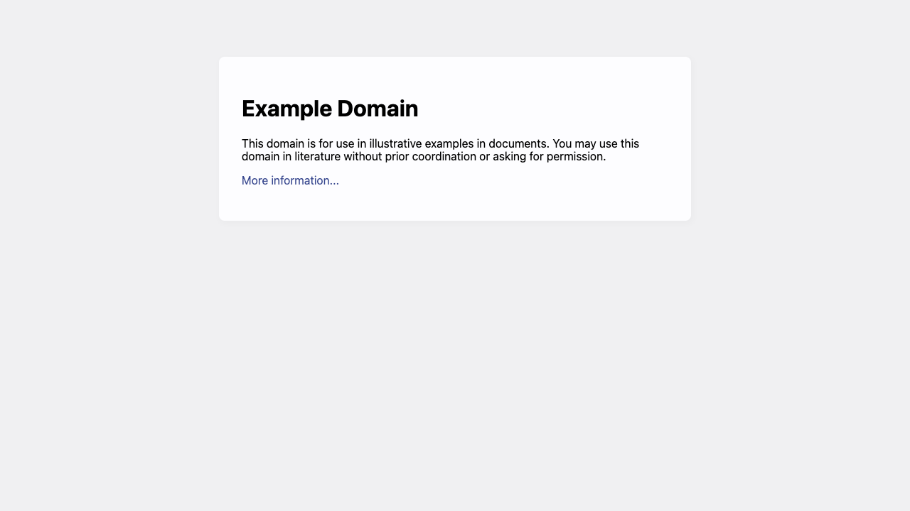
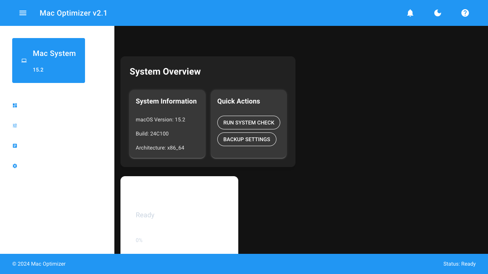

# macOS Optimizer

[](LICENSE)
[](https://www.apple.com/macos/)
[](cli/)
[-purple.svg)](gui/)
[](CONTRIBUTING.md)

> Fast, reversible system tweaks for macOS — from a polished terminal menu or a modern web UI.

macOS Optimizer helps you tune performance, clean caches, improve networking, and reduce visual overhead. Every meaningful change is backed up first so you can restore safely.

<p align="center">
  
  
</p>

## Why this project?

- **Two interfaces, one toolkit** — bash CLI for power users and automation; NiceGUI for a friendly desktop experience
- **Apple Silicon aware** — detects arm64, Rosetta, and Intel and adapts where it matters
- **Backup-first** — preferences and profiles are snapshotted before changes
- **Transparent** — each optimization explains impact, safety level, and reversibility
- **No telemetry** — runs fully on your machine

## Features

| Category | What it does |
|---|---|
| **Performance** | Kernel / process limits, high-performance power mode, responsiveness tweaks |
| **Graphics & UI** | Reduce transparency/motion, speed Dock and window animations |
| **Display** | Font smoothing, HiDPI-related display preferences |
| **Storage** | Clear safe caches, old logs, leftover snapshots, `.DS_Store` clutter |
| **Network** | TCP buffer and latency-oriented sysctl tuning |
| **Maintenance** | Backups, restore, system info dashboard, optional scheduled maintenance |

## Quick start

### Requirements

- macOS **10.15 Catalina** or later (Intel or Apple Silicon)
- Administrator privileges for some system-level tweaks
- GUI only: **Python 3.9+** and `pip`

### CLI (recommended for most users)

```bash
git clone https://github.com/samihalawa/macos-optimizer.git
cd macos-optimizer
make cli
# or:
chmod +x cli/src/macos-optimizer.sh
./cli/src/macos-optimizer.sh
```

Non-interactive helpers:

```bash
./cli/src/macos-optimizer.sh --version
./cli/src/macos-optimizer.sh --help
./cli/src/macos-optimizer.sh --info
```

### GUI

```bash
cd gui
python3 -m venv .venv
source .venv/bin/activate
pip install -r requirements.txt
python src/app.py
# open http://127.0.0.1:8080
```

Or from the repo root:

```bash
make gui
```

## Safety first

> [!IMPORTANT]
> This tool changes system preferences and, when elevated, kernel/network parameters. Create a Time Machine backup (or at least use the built-in backup) before bulk changes. Some `sysctl` values reset after reboot; preference-domain changes persist until restored.

- Prefer **one category at a time** the first run
- Use **Backup** before **Run All**
- Review logs under `~/.mac_optimizer/`
- Security-sensitive options are opt-in and documented

## Project layout

```text
macos-optimizer/
├── cli/                 # Terminal interface
│   └── src/macos-optimizer.sh
├── gui/                 # NiceGUI web interface
│   └── src/app.py
├── config/              # Shared defaults
├── docs/                # EN / ES / ZH guides + screenshots
├── tests/               # CLI smoke tests (bats)
├── Makefile             # Common developer commands
└── README.md
```

## Documentation

- [English](docs/en/README.md)
- [Español](docs/es/README.md)
- [中文](docs/zh/README.md)
- [Contributing](CONTRIBUTING.md)
- [Changelog](CHANGELOG.md)
- [Security](SECURITY.md)

## Contributing

Issues and PRs are welcome. See [CONTRIBUTING.md](CONTRIBUTING.md) for setup, style, and test expectations.

```bash
make test
```

## Disclaimer

macOS Optimizer is provided **as is**, without warranty. You are responsible for changes applied to your system. The authors are not liable for data loss, downtime, or hardware issues. Always keep a backup.

## License

[MIT](LICENSE) © Sami Halawa

---

If this project saves you time, a ⭐ on GitHub helps others find it.
