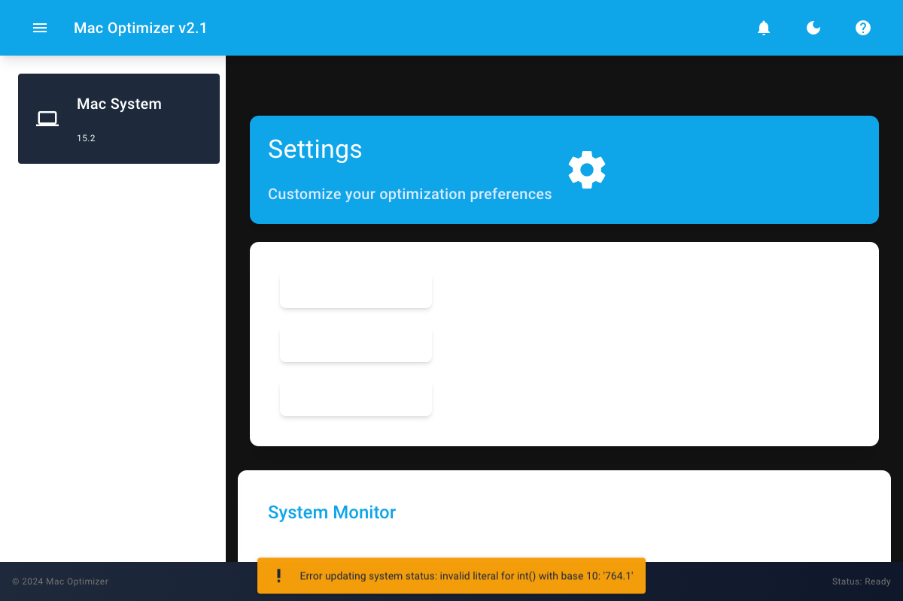

# macOS Optimizer: La 2ª Juventud de tu Mac

Una potente herramienta para optimizar y mejorar tu experiencia en macOS, disponible en versión CLI y GUI.

## Dos Versiones

### Versión CLI


Una interfaz tradicional de línea de comandos usando scripts Bash (`cli/src/script.sh`), perfecta para:
- Entornos de servidor
- Usuarios avanzados de terminal
- Scripts de automatización
- Administración remota

### Versión GUI


Una interfaz gráfica moderna construida con Python y NiceGUI (`gui/src/python-app-nicegui.py`), ideal para:
- Usuarios de escritorio
- Retroalimentación visual
- Monitoreo en tiempo real
- Controles amigables

## Características Clave

- **Ajustes del Sistema**: Desactiva servicios y características en segundo plano innecesarios, liberando recursos del sistema.
- **Gestión de Energía**: Optimiza la configuración de energía para extender la vida útil de la batería y mejorar la eficiencia energética.
- **Optimización de Red**: Ajusta configuraciones de red para una conectividad más rápida y fiable.
- **Mejoras de Rendimiento**: Implementa ajustes para mejorar la capacidad de respuesta y la velocidad general del sistema.

## Cómo Usarlo

1. **Clonar el Repositorio**:
   ```bash
   git clone https://github.com/samihalawa/macos-optimizer.git
   ```

2. **Navegar al Directorio del Repositorio**:
   ```bash
   cd macos-optimizer
   ```

3. **Hacer el Script Ejecutable**:
   ```bash
   cd cli/src
   chmod +x script.sh
   ```

4. **Ejecutar el Script**:
   ```bash
   ./script.sh
   ```

Sigue las indicaciones en pantalla para seleccionar y aplicar las optimizaciones deseadas.

## Mejoras y Beneficios

1. **Ajustes del Sistema**: Al desactivar servicios en segundo plano innecesarios, se mejora el rendimiento del sistema y se liberan recursos, lo que conduce a un sistema más receptivo y rápido.
2. **Optimización de la Gestión de Energía**: Ajustar la configuración de energía reduce el consumo de energía, extiende la vida útil de la batería y disminuye la tensión en los componentes del sistema, promoviendo la longevidad y la eficiencia.
3. **Optimización de Red**: Ajustar la configuración de la red mejora la velocidad y la fiabilidad de la conectividad, lo que resulta en experiencias en línea más fluidas y una mayor productividad.
4. **Mejoras de Rendimiento**: Implementar ajustes específicos de rendimiento mejora la capacidad de respuesta general del sistema, acelera los tiempos de lanzamiento de aplicaciones y facilita la multitarea de manera más fluida.

## Colaboración y Contribución

Se agradecen y se fomentan las contribuciones de la comunidad:

- **Informes de Errores**: Reporta cualquier problema o comportamiento inesperado abriendo un issue en GitHub.
- **Solicitudes de Funcionalidades**: Comparte ideas para nuevas optimizaciones o mejoras abriendo un issue.
- **Pull Requests**: Contribuye con mejoras de código haciendo un fork del repositorio, realizando cambios y enviando un pull request.

## Licencia

El macOS Optimizer se publica bajo la Licencia MIT, otorgando a los usuarios la libertad de usar, modificar y distribuir el software según sea necesario. Consulta el archivo [LICENSE](LICENSE) para más detalles.

## Descargo de Responsabilidad

Aunque el Optimizador de macOS se esfuerza por ser seguro y efectivo, se recomienda tener precaución al realizar cambios a nivel del sistema. Siempre realiza una copia de seguridad de tus datos antes de aplicar optimizaciones y úsalo bajo tu propio riesgo.
